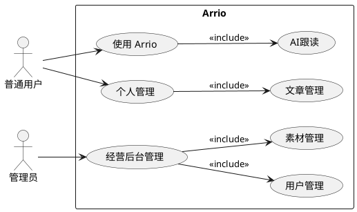
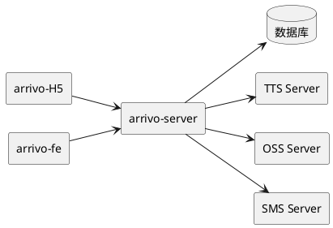

# Arrivo
Arrivo：突破语言的边界，就是打开世界的边界

奥地利哲学家维特根斯坦说过：“语言的边界就是世界的边界”。
语言不仅是沟通工具，更决定了我们思考、认知和理解世界的方式。

Arrivo 是一款以电影《降临》（Arrival）为灵感而诞生的语言学习软件，我们深刻认同维特根斯坦的哲学理念，致力于帮助你突破语言障碍，拓宽你认识世界的边界。

在这里，你将：

- 感受语言与思维的交汇，在语言学习中获得认知与思维的双重提升；
- 体验个性化的智能学习路径，实现高效、自然的语言掌握；、
- 通过沉浸式场景和互动教学，构建跨文化交流的自信；
- 真正领悟语言的哲学意义，理解世界，也更深入地理解自己。

加入Arrivo，突破语言的界限，拓展思维的深度与广度，与你的世界进行一次全新的连接。

Arrivo，让语言为你的世界降临。

